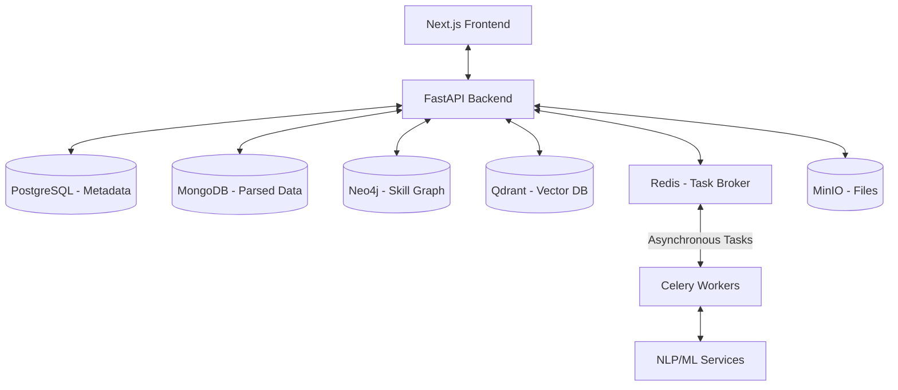

# Aura AI
**Intelligent Candidate-Job Matching Platform powered by NLP, Graph Neural Networks & LLMs**

## System Architecture



Aura AI follows a highly modular, event-driven architecture designed for high performance and scalability:
- **Core Engine (FastAPI)**: Synchronous REST API for management and orchestration.
- **Asynchronous Pipeline (Celery/Redis)**: Handles compute-intensive CV parsing and embedding generation without blocking.
- **Hybrid Data Layer**:
    - **Relational (PostgreSQL)**: Handles ACID transactional data and organization metadata.
    - **Unstructured (MongoDB)**: Stores flexible, parsed resume data.
    - **Graph (Neo4j)**: Models complex relationships between technical skills for gap analysis.
    - **Vector (Qdrant)**: Enables rapid semantic search and similarity matching using deep learning embeddings.

## Status: Implementation Phase 1 (Core Infrastructure & Ingestion)

The following core components have been implemented according to the specified architecture:

### Backend (FastAPI)
- **Database Layer**: Integrated support for PostgreSQL, MongoDB, Neo4j, Qdrant, MinIO, and Redis.
- **Models & Schemas**: Initial ER model implementation (Organization, User, JobPosition, Candidate).
- **Ingestion Pipeline**: Asynchronous CV parsing using Celery workers.
- **NLP Service**: PDF parsing and semantic indexing in Qdrant Vector DB.
- **API v1**: Endpoints for Job management and Candidate file uploads.

### Next Steps
1. **Explainable AI Layer**: Implement SHAP/LIME logic for score breakdown.
2. **Skill Knowledge Graph**: Populate Neo4j with skill taxonomies.
3. **Contrastive Matching Logic**: Fine-tune semantic similarity between Jobs and Resumes.
4. **Talent Dashboard (Frontend)**: Professional dashboard with candidate rankings and skill-gap radar.

## Tech Stack Summary
- **Backend**: FastAPI, SQLAlchemy, Celery.
- **ML/NLP**: PyTorch, LangChain, SentenceTransformers.
- **Storage**: PostgreSQL (Metadata), MongoDB (Parsed Data), Neo4j (Knowledge Graph), Qdrant (Vectors), MinIO (Files).
- **Communication**: Redis (Task Queue).

## How to Run (Local Dev)

### 1. Start Infrastructure (Docker)
```bash
docker-compose up -d
```

### 2. Run Backend
```bash
cd backend
python -m venv venv
# Activate venv
pip install -r requirements.txt
uvicorn app.main:app --reload
```

### 3. Run Celery Worker
```bash
cd backend
# Activate venv
celery -A app.tasks.celery_app worker --loglevel=info
```
