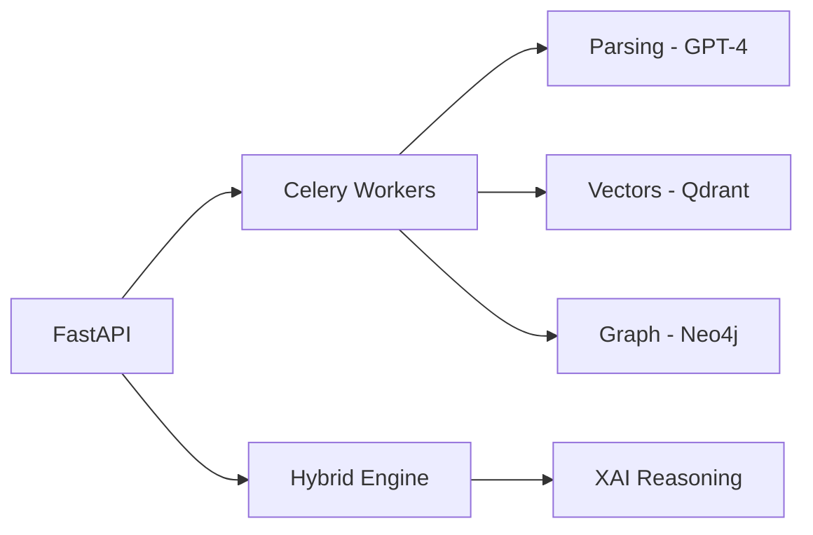

# Aura AI - Backend Engine

This is the core engine of Aura AI. It replaces traditional keyword-matching ATS with a high-performance, asynchronous system using vector embeddings, knowledge graphs, and deep learning to prioritize candidate fit.

## Core Philosophy
Aura matching shouldn't be about keyword density. This backend understands the context behind experience and maps relationships between technical skills that simple search engines miss.

## The AI Stack

- **Hybrid Semantic Search**: Combines vector similarity from Qdrant with graph constraints from Neo4j to understand skill depth and semantic relationships.
- **Skill Path Prediction (GNN)**: A custom Graph Convolutional Network built with PyTorch that predicts a candidate's potential to acquire missing skills based on their current profile.
- **Explainable AI (XAI)**: Every candidate score is accompanied by a natural language justification generated by GPT-4-Turbo, explaining the reasoning behind the rank.
- **Intelligent Ingestion**: Asynchronous CV parsing using LangChain and GPT-4 for structured data extraction.

## API Documentation

### Authentication
- `POST /api/v1/auth/registration`: Register a new recruiter and organization.
- `POST /api/v1/auth/token`: Authenticate and obtain a JWT token.

### Job Positions
- `POST /api/v1/jobs/`: Create a new job position with requirements.
- `GET /api/v1/jobs/`: List all job positions for the organization.
- `GET /api/v1/jobs/{id}`: Retrieve details for a specific position.
- `GET /api/v1/jobs/{id}/rank`: Rank candidates using the Hybrid Search engine (includes XAI reasoning).

### Candidates
- `POST /api/v1/candidates/{job_id}`: Upload a resume (PDF/DOCX) for a specific job and trigger the async NLP pipeline.
- `GET /api/v1/candidates/{id}`: Get detailed candidate profile and parsing status.
- `GET /api/v1/candidates/job/{job_id}`: List all candidates associated with a specific job.

## Technology Stack

- **FastAPI**: Core API framework.
- **PostgreSQL**: Relational metadata and user management.
- **MongoDB**: Unstructured document and JSON storage.
- **Neo4j**: Skill knowledge graph and gap analysis.
- **Qdrant**: Vector search engine for semantic matching.
- **MinIO**: Object storage for original CV files.
- **Celery & Redis**: Background task orchestration for heavy NLP processing.

## Architecture

## Setup Instructions

1. **Environment Config**: Create a `.env` file with `OPENAI_API_KEY`, `SECRET_KEY`, and database passwords.
2. **Infrastructure**: Run `docker-compose up -d` to start all 6 specialized databases.
3. **Application**: Run `pip install -r requirements.txt` and start the server with `uvicorn app.main:app --reload`.

## Security & Reliability
All endpoints are protected via JWT authentication and isolation at the organization level. The codebase is fully linted with ruff and formatted with black.
